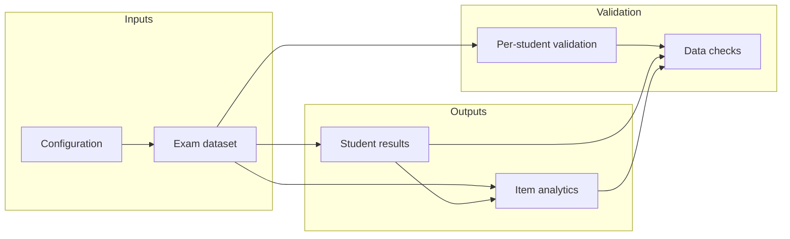

# Functional Design — Exam Results Analysis

## 1. Purpose

This document describes the **functional design** of an exam results analysis capability (Paragin developer assignment). The system ingests exam result data and produces:

1. **Student outcomes** — total score, percentage, grade (1.0–10.0), pass/fail.
2. **Question analytics** — psychometric indicators (P′, rit) to help tutors assess item quality.
3. **Data integrity checks** — validation of input scores against per-question maximums.

The design is **reusable across exams**: operators select an exam dataset and adjust grading configuration (caesura) without changing the underlying rules.

Rules in this document were validated manually in a spreadsheet; see **[Prototype.md](Prototype.md)** for the workbook artifact, structure, and sheet formulas.

---

## 2. Scope

### In scope

- Multiple exam datasets with variable student and question counts.
- Configurable grading boundaries (caesura).
- Calculations that adapt automatically to the selected exam.
- Per-student validation with question-level error reporting.
- A dedicated **data checks** summary for dataset health and output sanity.
- Visual interpretation aids (color coding, optional category labels, summary charts).

### Out of scope

- Automated import pipelines (beyond the agreed file layout).
- User authentication or multi-tenant deployment.
- Institution-specific psychometric norms (category thresholds are configurable conventions).

---

## 3. Functional areas

The capability is organised into the following areas (logical modules or screens):

| Area | Role |
|------|------|
| **Welcome** | User-facing help and orientation |
| **Configuration** | Grading parameters and active exam dataset selection |
| **Exam data** | One or more imported exams (read-only source; not altered by analysis) |
| **Data checks** | Dataset health and output sanity summary |
| **Student results** | Per-student grades and pass/fail; optional pass/fail pie and grade distribution bar chart |
| **Item analytics** | Per-question P′ and rit (and optional quality labels) |

---

## 4. Input data contract

Each exam dataset must follow this structure:

| Part | Content |
|------|---------|
| Question headers | Field names: student identifier, then one field per question (e.g. `Score Question 1`, …) |
| Per-question maxima | Metadata: label `Max question score:` on the first field, then the maximum attainable score per question |
| Student records | One record per student: identifier, then score for each question |

### Assumptions

- Structure is **fixed** across datasets; only the number of students and questions may vary.
- Scores may reflect **partial credit** (non-integer values, e.g. 2.1 points on a 3-point item).
- Missing score values are treated as zero where applicable.
- The first field of the per-question maxima metadata is a label, not a numeric maximum.

### Multiple exams

- Configuration includes **active exam dataset** (e.g. a primary sample exam and an alternate sample for testing).
- All analysis uses the currently selected exam.
- Changing the selection refreshes student results, item analytics, and data checks for that exam.

---

## 5. Configuration

| Parameter | Default | Description |
|-----------|---------|-------------|
| `activeExam` | (primary sample exam) | Identifier of the exam dataset to analyze |
| `minPct` | 0.2 | Lower grade boundary (fraction of max score) |
| `passPct` | 0.7 | Pass threshold (fraction of max score) |
| `maxPct` | 1.0 | Upper grade boundary (fraction of max score) |
| `minGrade` | 1.0 | Grade at or below `minPct` |
| `passGrade` | 5.5 | Grade at `passPct` (minimum passing grade) |
| `maxGrade` | 10.0 | Grade at `maxPct` |

Each parameter may have a short human-readable description in the configuration UI.

The operator selects the active exam from the configured list of available exam datasets.

---

## 6. Formulae reference

Calculations required by the assignment specification ([Developer Assignment - Generic.pdf](Developer%20Assignment%20-%20Generic.pdf)), expressed in plain notation (code-style variables; symbols such as ≤ and ÷).

**Notation**

| Symbol | Meaning |
|--------|---------|
| `s[k,i]` | Score of student `k` on question `i` |
| `M[i]` | Maximum score for question `i` (from per-question maxima metadata) |
| `N` | Number of students |
| `Q` | Number of questions |
| `T[k]` | Total score for student `k` |
| `M_tot` | Sum of all question maxima |
| `p[k]` | Percentage for student `k` (`T[k] / M_tot`) |
| `p_min`, `p_pass`, `p_max` | Grade boundaries (`minPct`, `passPct`, `maxPct`) |
| `g_min`, `g_pass`, `g_max` | Grades at those boundaries (`minGrade`, `passGrade`, `maxGrade`) |
| `P'[i]` | P′ for question `i` |
| `rit[i]` | rit for question `i` |

### 6.1 Grading and pass/fail (assignment specification)

**Relative score.** The assignment defines grading relative to the maximum attainable total score. A candidate passes when:

```
total score / maximum total score  ≥  passPct
```

With default `passPct = 0.7`, that is at least **70%** of the available points.

**Caesura (piecewise grade scale).** Grades range from **1.0** to **10.0** (one decimal). For this exam, anchors are:

| Percentage of max total | Grade | Pass? |
|-------------------------|-------|-------|
| ≤ 20% (`minPct`) | 1.0 (`minGrade`) | No |
| 70% (`passPct`) | 5.5 (`passGrade`) | Yes (threshold) |
| 100% (`maxPct`) | 10.0 (`maxGrade`) | Yes |

Between anchors, the assignment implies **linear interpolation** (piecewise linear grading boundaries). At or below the lowest anchor, grade is the minimum; at or above the highest, grade is the maximum.

### 6.2 Student results — formulae

For each student `k`:

| Output | Formula |
|--------|---------|
| Total score | `T[k] = sum of s[k,i] for i = 1..Q` (missing scores = 0) |
| Maximum score | `M_tot = sum of M[i] for i = 1..Q` |
| Percentage | `p[k] = T[k] / M_tot` (if `M_tot = 0`, use 0) |
| Grade `g[k]` | Piecewise rule below; **round to 1 decimal** |
| Pass/fail | **Pass** if `p[k] ≥ passPct`; otherwise **Fail** |

**Piecewise grade** `g(p)` for percentage `p = T[k] / M_tot`.

Evaluate **in order**; stop at the first matching row:

| Step | Condition | Grade `g` |
|------|-----------|-----------|
| 1 | `p ≤ p_min` | `g_min` |
| 2 | `p ≤ p_pass` | `g_min + (p - p_min) × (g_pass - g_min) / (p_pass - p_min)` |
| 3 | `p ≤ p_max` | `g_pass + (p - p_pass) × (g_max - g_pass) / (p_max - p_pass)` |
| 4 | otherwise (`p > p_max`) | `g_max` |

**Anchor mapping** (defaults): `p_min` = `minPct` (0.2), `p_pass` = `passPct` (0.7), `p_max` = `maxPct` (1.0); `g_min` = 1.0, `g_pass` = 5.5, `g_max` = 10.0.

**Checkpoints:** at `p = p_min` → `g_min`; at `p = p_pass` → `g_pass`; at `p = p_max` → `g_max`.

**Final grade:** `g[k] = round(g(p[k]), 1)`.

### 6.3 Item analytics — formulae

**P′ (difficulty)** — as in the assignment (PDF: quotient of average score and maximum score):

```
P'[i] = avg_score[i] / M[i]
```

where `avg_score[i] = (s[1,i] + s[2,i] + … + s[N,i]) / N`. Range **0 to 1**. Empty when `M[i] = 0`.

**rit (discrimination)** — as in the assignment: correlation `r` between item scores and **test result** (total exam score):

```
rit[i] = correlation( (s[1,i], …, s[N,i]), (T[1], …, T[N]) )
```

Use **Pearson correlation** between the item score vector and the total-score vector. Range about **−1 to +1**. Omit when undefined (e.g. no variance on the item).

**Optional category labels** (configurable thresholds; not defined in the assignment PDF):

| Label | Condition on `P'[i]` |
|-------|----------------------|
| Too hard | `P'[i] < 0.30` |
| OK | `0.30 ≤ P'[i] ≤ 0.85` |
| Too easy | `P'[i] > 0.85` |

| Label | Condition on `rit[i]` |
|-------|------------------------|
| Weak | `rit[i] < 0.20` (or missing) |
| Review | `0.20 ≤ rit[i] < 0.30` |
| Good | `rit[i] ≥ 0.30` |

**Pie chart counts** (number of questions per band):

- `n_too_hard` = count of questions where `P'[i] < 0.30`
- `n_OK` = count where `0.30 ≤ P'[i] ≤ 0.85`
- `n_too_easy` = count where `P'[i] > 0.85`

(and analogously for Weak / Review / Good on rit, excluding questions with no valid rit).

### 6.4 Per-student data check — formulae

For student `k`, question `i` is flagged if any of:

- `s[k,i] < 0`, or
- `s[k,i] > M[i]` (when `s[k,i]` is numeric), or
- `s[k,i]` is non-empty and not numeric

Let `F[k]` be the set of flagged question numbers. Message:

- If `F[k]` is empty: **OK** (or no message, if configured)
- Else: **Check Q:** plus comma-separated question numbers (e.g. `Check Q: 1, 5, 39`)

### 6.5 Data checks summary — formulae

Aggregates over the selected dataset, for example:

| Check | Formula (conceptual) |
|-------|----------------------|
| Student count | `N` |
| Question count | `Q` |
| Students with score errors | count of students where `F[k]` is not empty |
| P′ out of range | count of questions where `P'[i] < 0` or `P'[i] > 1` |
| Grades out of range | count of students where `g[k] < 1` or `g[k] > 10` |
| Pass count | count of students where `p[k] ≥ passPct` |
| Fail count | count of students where `p[k] < passPct` |

---

## 7. Grading logic (Student results)

### Per-student outputs

| Output field | Meaning |
|--------------|---------|
| Student identifier | Taken from the selected exam dataset |
| Total score | Sum of the student’s question scores |
| Maximum score | Sum of per-question maximum scores for the exam |
| Percentage | Total score ÷ maximum score |
| Grade | Derived from percentage using the piecewise curve below, rounded to one decimal |
| Pass/fail result | `Pass` if percentage ≥ pass threshold, otherwise `Fail` |
| Data check | Per-student validation message (see §6.4 and §8) |

### Piecewise grade curve

Full definition: **§6.2** (step table and symbols `p_min`, `g_pass`, etc.).

Anchors (percentage → grade):

- `(minPct, minGrade)` → default `(20%, 1.0)`
- `(passPct, passGrade)` → default `(70%, 5.5)`
- `(maxPct, maxGrade)` → default `(100%, 10.0)`

Between anchors, grade is **linearly interpolated**. At or below `minPct`, grade is `minGrade`; at or above `maxPct`, grade is `maxGrade`.

### Pass/fail rule

- **Pass:** percentage ≥ `passPct` (default: at least 70% of the maximum attainable score).
- **Fail:** otherwise.

### Reference totals (primary sample exam)

For the assignment’s real sample exam, expected outcomes are approximately:

- 49 questions, maximum total score **90**
- **452** students
- **68** passed, **384** failed (~15% pass rate)
- Minimum points to pass: **63.0** (70% of 90)

Sample data and verification details: [Prototype.md](Prototype.md) §7–§8.

---

## 8. Per-student data validation

For each student, the system compares every question score to that question’s maximum (from per-question maxima metadata).

### Conditions flagged

- Negative numeric score
- Score greater than the question maximum
- Non-numeric value where a score is expected

### Messages shown to the user

- No issues: `OK` (or no message, if configured)
- Issues: `Check Q: 1, 5, 39` — comma-separated **question numbers** only

### Design note

Grades and question analytics **are still computed** when input errors exist. Users should treat outcomes as **provisional** until data checks and per-student messages indicate a clean dataset.

---

## 9. Question analytics (Item analytics)

### Per-question outputs

| Output field | Definition |
|--------------|------------|
| Question label | `Question 1`, `Question 2`, … (count matches the selected exam) |
| Maximum score | From per-question maxima for that question |
| Average score | Mean score across all students on that question |
| P′ (PPrime) | `P'[i]` per §6.3 (range 0–1) |
| rit | `rit[i]` per §6.3 (correlation with total score) |

### Interpretation

**P′ (difficulty)**

- Higher P′ → easier question (students obtain a larger share of available points on average).
- High P′ is not automatically desirable; very easy or very hard items may both warrant review.

**rit (discrimination)**

- Measures how strongly performance on this question aligns with overall exam performance.
- Higher rit → better alignment with stronger students (generally desirable).
- Low or negative rit → weak or potentially misleading item.

### Optional category labels (recommended)

| Label field | Rules (default thresholds) |
|-------------|------------------------------|
| Difficulty | `Too hard` if P′ < 0.30; `Too easy` if P′ > 0.85; otherwise `OK` |
| Discrimination | `Weak` if rit < 0.20; `Review` if 0.20–0.29; `Good` if ≥ 0.30 |

Thresholds are operational conventions, not formal psychometric standards.

### Missing rit values

rit may be omitted when correlation cannot be computed (e.g. all students scored the same on the item). This is expected for constant-score questions.

---

## 10. Data checks

A tutor-facing summary of dataset health. It does **not** block other calculations; it helps users decide whether to trust the results.

### Checks provided

| Check | Purpose |
|-------|---------|
| Active exam | Confirms which exam is being analyzed |
| Student count | Matches number of student records in the input |
| Question count | Matches number of questions in the input |
| Students with score errors | Count of students whose data check message lists problematic questions |
| Invalid maximum scores | Missing, non-numeric, or non-positive per-question maxima |
| Invalid student scores | Negative values or scores above the question maximum |
| P′ out of expected range | Output sanity (expected 0–1) |
| Grades out of expected range | Output sanity (expected 1.0–10.0) |
| Pass / fail counts | Summary of exam outcomes |

### Status message (recommended)

A prominent message at the top of the data checks view, driven by the number of students with score errors, for example:

- **No students with score errors** → “Input data looks valid.”
- **One or more students with score errors** → “Input data issues found — review before trusting grades and analytics.”

---

## 11. Visual presentation

Visual rules are **display-only**; they do not change calculated values.

### Student results

| Element | Presentation |
|---------|----------------|
| Pass/fail result | **Fail** shown in red (text and/or background); **Pass** may use neutral or subtle green styling |
| Data check message | Messages beginning with `Check Q:` highlighted in amber; **OK** may use subtle green or remain neutral |

When highlighting data-check issues, tie the highlight to **that student’s result** so tutors can spot the student immediately.

### Student results — summary charts (recommended)

Optional charts on the student results view complement the item-level pie charts:

1. **Pass / fail (pie chart)** — slice counts for `Pass` and `Fail` (same values as the pass/fail column). Gives a quick cohort outcome next to the student table. Slice colors should align with pass/fail styling (e.g. subtle green vs red). Counts must match the data checks pass/fail totals for the active exam.

2. **Grade distribution (bar chart)** — shows how many students fall in each grade band. Default: **one bar per whole grade** from 1 through 10, based on the rounded grade (1.0–10.0, one decimal). Alternative: wider bands (e.g. 1.0–2.9, 3.0–4.9, …) or percentage bands if tutors prefer raw performance over translated grades. The chart is display-only; bin edges should stay consistent when switching exams. The sum of bin counts must equal the student count.

Charts refresh when the operator selects a different exam dataset.

### Item analytics — value bands

| Metric | Visual bands |
|--------|----------------|
| P′ | Red: too hard (< 0.30); green: acceptable band (0.30–0.85); orange: too easy (> 0.85) |
| rit | Red: weak (< 0.20); amber: review (0.20–0.29); green: good (≥ 0.30) |
| Category labels | Color by label text (Too hard / Too easy / OK; Weak / Review / Good) |

Do **not** use a simple “higher number = greener” scale for P′ alone — a high P′ means an easier question, not necessarily a better one.

### Item analytics — summary charts

Two pie charts give tutors a quick count of questions in each band:

1. **Questions by difficulty (P′)** — slices: Too hard, OK, Too easy (same thresholds as above).
2. **Questions by discrimination (rit)** — slices: Weak, Review, Good (same thresholds as above).

Each chart uses counts of questions per category. Slice colors should match the band colors used in the item list (red / green / orange for P′; red / amber / green for rit). Questions with no computable rit are excluded from the discrimination chart.

If difficulty and discrimination **labels** are shown, counts may be based on those labels instead of raw P′ and rit values.

Charts refresh when the operator selects a different exam dataset.

---

## 12. Data flow



---

## 13. Verification and sample data

Assignment sample exams, expected totals, CSV exports, and independent pass/fail verification are documented in **[Prototype.md](Prototype.md)** §7–§8. That material supports QA of the spreadsheet artifact; it is not part of the end-user functional surface.

---

## 14. Known limitations

- Calculations assume a consistent input layout; malformed datasets may produce misleading results.
- Changing exam dataset identifiers without updating configuration breaks analysis for that exam.
- Very large exams (many questions or students) may require pagination or batching in the UI.
- Psychometric category thresholds are rules of thumb, not institution-specific norms.

---

## 15. Implementation notes

When building software to this specification:

1. Persist configuration parameters (§5) as settings or policy records.
2. Import exam data according to the contract in §4.
3. Implement grading as a pure function: `(total, max, caesura) → grade` per §6.2.
4. Implement P′ and rit per item per §6.3.
5. Encode validation rules from §6.4, §8, and §10 as automated tests.
6. Keep presentation (colors, charts, labels) separate from core calculation logic.

---

## 16. Assignment traceability

| Assignment requirement | Specification | Functional area |
|------------------------|---------------|-----------------|
| Grade per student (1.0–10.0, one decimal) | Caesura §6.1–6.2 | Student results — grade |
| Pass/fail at 70% | Pass rule §6.1 | Student results — pass/fail |
| P′ per question | `P'[i] = avg_score[i] / M[i]` §6.3 | Item analytics — P′ |
| rit per question | Correlation with test result §6.3 | Item analytics — rit |
| Reusable for other exams | Configurable caesura | Configuration + multiple exam datasets |

---

## 17. Document history

| Version | Notes |
|---------|--------|
| 1.0 | Initial functional design |
| 1.1 | Pie charts; technical artifacts moved to TechnicalDesign.md |
| 1.2 | Rewritten in domain language (minimal spreadsheet terminology) |
| 1.3 | Added §6 formulae reference (assignment PDF) |
| 1.3.1 | Clarified piecewise grade notation (step table + anchor symbols) |
| 1.4 | §6 formulae in plain Markdown (no LaTeX) |
| 1.5 | Removed spreadsheet/prototype implementation; product-focused functional areas |
| 1.6 | Linked to Prototype.md for spreadsheet validation artifact |
| 1.7 | Student results charts: pass/fail pie and grade distribution bar (§11) |
