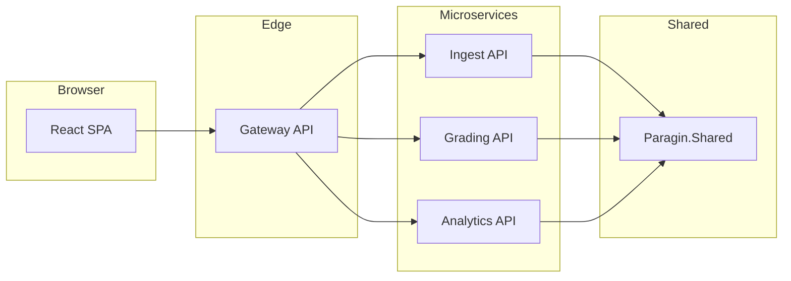

# Technical Design — Exam Results

## 1. Purpose

This document covers:

1. **Prototype phase** — spreadsheet workbook, CSV fixtures, and Python verification scripts (completed).
2. **Target implementation** — a web product backed by **C# / ASP.NET Core** microservices, with a separate front end, upload of score data, and Docker-based deployment for production-like hosting.

It complements [FunctionalDesign.md](FunctionalDesign.md), which describes *what* the system must do for tutors and reviewers (domain rules, outputs, validation, visuals). This file describes *how* the prototype was verified and *how* the product will be built and run.

**Audience:** developers, C# reviewers, anyone deploying or extending the codebase.

**Not in scope here:** psychometric interpretation and tutor UX copy (see Functional Design).

---

## 2. Repository layout

The repository is organised into a **prototype** area (existing work) and a planned **implementation** area (product code). Documentation lives under `docs/` (or repo root today).

### 2.1 Prototype artifacts (current)

| Artifact | Role |
|----------|------|
| Google Sheets workbook (`Developer Assignment - prototype.xlsx`) | Validated logic: grading, P′, rit, data checks, charts |
| `user_data/Developer Assignment - prototype.xlsx - InputData_1.csv` | Real sample exam export |
| `user_data/Developer Assignment - prototype.xlsx - InputData_2.csv` | Synthetic second exam |
| `Developer Assignment Sample_Data.xlsx` | Original assignment sample |
| `compute_pass_fail.py` | Independent pass/fail verification (not yet in repo) |
| `generate_input_data_2.py` | Regenerate synthetic InputData_2 (not yet in repo) |
| `FunctionalDesign.md` | Functional / domain design |
| `TechnicalDesign.md` | This file |

Committed fixtures live in `user_data/` today. Optional future layout: `prototype/data/` and `prototype/scripts/` when scripts are added to the repo.

**Functional Design §13** (verification and sample data) is implemented by Technical Design §§3–7 below.

### 2.2 Implementation tree (planned)

```text
implementation/
├── Paragin.slnx
├── src/
│   ├── Paragin.Shared/              # Domain: CSV parse, grading, P′, rit, validation
│   └── Paragin.Web/                 # Blazor Web App (Server) — UI + in-process domain calls
├── tests/
│   └── Paragin.Shared.Tests/        # xUnit regression tests (user_data fixtures)
└── scripts/                         # Optional dev helpers (future)
```

**v1 profile:** monolith-first — `Paragin.Web` hosts the Blazor UI and calls `Paragin.Shared` directly. No Node.js server; no separate API host required for local review. Microservice projects (`Paragin.Ingest.Api`, etc.) may be added later without changing Shared.

**Design principle:** all business rules live in `Paragin.Shared` once. The web host is a thin shell. Python verification scripts remain regression references until equivalent automated tests exist in .NET (tests are in place for pass/fail on InputData_1/2).

### 2.3 Functional Design cross-reference

| Functional Design | Topic | Technical Design |
|-------------------|-------|------------------|
| §3 | Functional areas / screens | §8.3, §8.3.1 |
| §4 | Input data contract | §3 |
| §5 | Configuration | §8.1, §8.4 |
| §6–§7 | Formulae and grading | §8.1 (`Paragin.Shared`, Grading API) |
| §8 | Per-student validation | §8.1, §8.4 |
| §9 | Item analytics | §8.1, §8.4 |
| §10 | Data checks | §8.1, §8.4 |
| §11 | Visual presentation | §8.3 |
| §13 | Verification and sample data | §§4–7, `user_data/` |
| §15 | Implementation notes | §10 checklist |

---

## 3. Input CSV contract (prototype and product)

The workbook, Python scripts, and future ingest service share the same layout (Functional Design [§4](FunctionalDesign.md#4-input-data-contract); summarized here as Technical Design §3):

- **Row 1:** headers (`ID`, `Score Question 1`, …)
- **Row 2:** `Max question score:` in column A; numeric maxima from column B
- **Row 3+:** one student per row

Scripts read UTF-8 with BOM (`utf-8-sig`) when loading headers from `user_data/...InputData_1.csv`.

---

## 4. `compute_pass_fail.py`

### Purpose

Verify pass/fail totals **without** opening the Google Sheets workbook or Excel. Applies the same rule as Functional Design §7: **Pass** when `total_score / max_total_score >= passPct` (default 0.7).

### Algorithm

1. Parse row 2 → list of per-question max scores; `max_total = sum(max_scores)`.
2. For each student row (row 3+), sum score columns (blank → 0).
3. `passed` if `total >= 0.7 * max_total`, else `failed`.
4. Print counts and pass rate.

### Usage

```bash
python compute_pass_fail.py "user_data/Developer Assignment - prototype.xlsx - InputData_1.csv"
python compute_pass_fail.py "user_data/Developer Assignment - prototype.xlsx - InputData_2.csv"
```

### Expected output (reference)

**InputData_1** (real sample, seed N/A):

| Metric | Value |
|--------|-------|
| Questions | 49 |
| Max total | 90 |
| Students | 452 |
| Passed | 68 |
| Failed | 384 |
| Pass rate | ~15.0% |
| Min points to pass | 63.0 |

**InputData_2** (synthetic, default seed `2026` in generator):

| Metric | Typical value |
|--------|----------------|
| Max total | ~125 (varies per run) |
| Students | 452 |
| Passed | ~280–290 |
| Failed | ~160–170 |
| Pass rate | ~58–63% (by design) |

Compare these totals to `OUT_StudentResults` (`COUNTIF` on Pass/Fail) after importing CSV into a tab and setting `Config!B1`.

### Dependencies

- Python 3.x, standard library only (`csv`, `pathlib`, `sys`).
- No Excel installation required.

---

## 5. `generate_input_data_2.py`

### Purpose

Produce **[user_data/Developer Assignment - prototype.xlsx - InputData_2.csv](user_data/Developer%20Assignment%20-%20prototype.xlsx%20-%20InputData_2.csv)** for testing:

- Switching `Config!B1` between `InputData_1` and `InputData_2`
- Variable per-question max scores
- Mix of pass and fail outcomes (unlike the very hard real sample)

### Algorithm

1. Copy header row from `InputData_1` CSV.
2. Random max per question from `[1, 1, 1, 2, 2, 3, 3, 5]`.
3. For each of 452 students:
   - With probability `PASS_RATE_TARGET` (default **0.58**), set target total ∈ [pass_min + 0.5, 0.98 × max_total].
   - Otherwise target total ∈ [0.10 × max_total, pass_min − 0.5].
   - Distribute target across questions with noise; iteratively adjust so sum ≈ target; clamp each cell to `[0, max_question]`.
4. Write CSV; report pass/fail counts and constraint violations (score > max).

### Configuration constants

| Constant | Default | Meaning |
|----------|---------|---------|
| `PASS_THRESHOLD` | 0.70 | Same as Functional Design §5 `passPct` |
| `PASS_RATE_TARGET` | 0.58 | Intended fraction of passing students |
| `NUM_STUDENTS` | 452 | Match sample size |
| `MAX_SCORE_CHOICES` | 1,1,1,2,2,3,3,5 | Pool for row 2 maxima |

### Usage

```bash
python generate_input_data_2.py
python generate_input_data_2.py "header_source.csv" "output.csv" 42
```

Third argument optional: random **seed** (default `2026`).

### Post-generation workflow

1. Import or paste CSV into workbook tab `InputData_2`.
2. Set `Config!B1` to `InputData_2`.
3. Run `python compute_pass_fail.py "…InputData_2.csv"` and compare to sheet Pass/Fail counts.

---

## 6. Datasets

### InputData_1 (real sample)

- Path: `user_data/Developer Assignment - prototype.xlsx - InputData_1.csv`
- Origin: Paragin assignment `Developer Assignment Sample_Data.xlsx`.
- Characteristics: mixed partial credit; many questions max 1; some items max 2–5; **low pass rate** (~15%).
- Use case: realistic difficulty, psychometric spread, validation of `P'` and `rit`.

### InputData_2 (synthetic)

- Path: `user_data/Developer Assignment - prototype.xlsx - InputData_2.csv`
- Origin: `generate_input_data_2.py`.
- Characteristics: random maxima per column; scores always ≤ column max; **moderate pass rate** (~60%) for testing Pass/Fail visuals and summaries.
- Use case: prove switchable input and charts/recounts without editing real data.

**Do not** treat InputData_2 as a real exam—only as a test fixture.

---

## 7. Verification checklist

| Step | Action |
|------|--------|
| 1 | Export active input tab to CSV (or use committed CSV). |
| 2 | `python compute_pass_fail.py "<file>.csv"` → note Passed/Failed. |
| 3 | In workbook, `Config!B1` = matching tab; check `OUT_StudentResults` Pass/Fail counts. |
| 4 | Counts should match (allow rounding only on grade column, not Pass/Fail). |
| 5 | Spot-check one student: manual sum vs `TotalScore`; percentage vs `passPct`. |
| 6 | `Data Checks`: zero students with `Check Q:` on clean data. |
| 7 | Switch to `InputData_2`; repeat 2–6. |

---

## 8. Target implementation architecture

### 8.1 Overview

| Layer | Technology | Responsibility |
|-------|------------|----------------|
| **Front end** | Blazor Web App (Interactive Server) in `Paragin.Web` | Welcome, configuration, student results, item analytics, data checks (FD §3, §11) |
| **Web host** | ASP.NET Core (`Paragin.Web`) | Kestrel only — serves Blazor UI; calls Shared in-process (v1 monolith) |
| **Shared library** | .NET class library (`Paragin.Shared`) | Pure domain logic; unit-tested; no HTTP |

The back end is **C# only**. There is **no Node.js server** and no npm requirement for v1.

**Future split (optional):** extract thin API projects (`Paragin.Grading.Api`, etc.) that reference the same `Paragin.Shared` assembly; Blazor or a Gateway would call them over HTTP instead of in-process.

### 8.2 Microservices (logical boundaries)



**Typical flows**

1. **Upload** — User posts CSV → Gateway → Ingest → parse & validate → return `datasetId` and summary (student/question counts, validation errors).
2. **Student results** — UI requests `GET /datasets/{id}/students` (via Gateway) → Grading service uses shared grading + validation rules.
3. **Item analytics** — UI requests `GET /datasets/{id}/items` → Analytics service computes P′ and rit from stored scores.
4. **Configuration** — Caesura parameters (`minPct`, `passPct`, grades, etc.) sent on each request or stored per session; defaults match Functional Design §5.

Initial persistence may be **in-memory or SQLite per dataset** on a laptop; production may use a shared database or blob store for uploads.

### 8.3 Front end (Blazor)

- **Blazor Web App** with **Interactive Server** render mode — all UI in C# / Razor; **no Node.js server**.
- Single process: `dotnet run --project src/Paragin.Web` (Kestrel serves the app).
- One `.razor` page per Functional Design §3 screen; routes in §8.3.1.
- Styling and band colors follow Functional Design §11 (CSS in `wwwroot/app.css`; not in Shared).

#### 8.3.1 Views and routing

The app maps Functional Design §3 **functional areas** to **Blazor pages**. The **home page is Welcome** — opening the app or visiting `/` lands there first.

| Route | Page | FD §3 area | Role |
|-------|------|------------|------|
| `/` | `Welcome.razor` | Welcome | Home page: orientation, what the tool does, links into the workflow |
| `/configuration` | `Configuration.razor` | Configuration | Caesura parameters; active exam selection |
| `/configuration` (same page) | *(Exam data section)* | Exam data | Upload CSV or pick a loaded dataset; read-only source |
| `/students` | `StudentResults.razor` | Student results | Per-student total, percentage, grade, pass/fail, data-check message |
| `/items` | `ItemAnalytics.razor` | Item analytics | Per-question P′, rit, labels; band counts (FD §11) |
| `/checks` | `DataChecks.razor` | Data checks | Dataset health summary and status message (FD §10) |

**Navigation**

- Persistent **nav menu** in `MainLayout`: Welcome, Configuration, Data checks, Student results, Item analytics.
- **Welcome** (`/`) is the default route; brand link returns to Welcome.
- **Exam data** lives on **Configuration** (upload + dataset picker), not a separate route in v1.

**Suggested workflow** (mirrors Functional Design §12)

1. Welcome → brief orientation  
2. Configuration → upload or select exam, adjust caesura if needed  
3. Data checks → confirm input sanity  
4. Student results / Item analytics → review outcomes  

**Front-end layout** (`src/Paragin.Web/`)

```text
src/Paragin.Web/
├── Components/
│   ├── Pages/
│   │   ├── Welcome.razor           # @page "/"
│   │   ├── Configuration.razor
│   │   ├── StudentResults.razor
│   │   ├── ItemAnalytics.razor
│   │   └── DataChecks.razor
│   └── Layout/
│       └── NavMenu.razor
├── Services/
│   └── ExamSessionService.cs       # active dataset, config, in-memory store
└── Program.cs
```

**Data loading:** `ExamSessionService` holds the active dataset and caesura config; result pages call `ExamAnalyzer.Analyze` via Shared on each load (FD §4, §5).

### 8.4 Mapping functional areas → code

| Functional area (FD §3) | Functional spec | Implementation |
|-------------------------|-----------------|----------------|
| Welcome | FD §3 | `Welcome.razor` at `/`; §8.3.1 |
| Configuration | FD §5 | `Configuration.razor`; `ExamSessionService` |
| Exam data | FD §4 | Upload + dataset picker on Configuration; `ExamCsvParser` in Shared |
| Student results | FD §6.2, §7 | `StudentResults.razor`; `ExamAnalyzer` in Shared |
| Per-student data check | FD §6.4, §8 | Column on Student results; `StudentValidator` in Shared |
| Item analytics | FD §6.3, §9 | `ItemAnalytics.razor`; `ExamAnalyzer` in Shared |
| Data checks | FD §10 | `DataChecks.razor`; summary from `ExamAnalyzer` |
| Visual presentation | FD §11 | Blazor markup + CSS band classes; not in Shared |
| Verification fixtures | FD §13 | `user_data/` CSVs; xUnit in `Paragin.Shared.Tests` |

---

## 9. Deployment profiles

### 9.1 Local development (laptop / reviewer)

**Goal:** run the site with **.NET SDK only** — no Node.js, no Docker.

| Profile | Description | How to run |
|---------|-------------|------------|
| **Monolith (v1)** | `Paragin.Web` Blazor app + Shared in one process | `dotnet run --project src/Paragin.Web` |
| **Tests** | Shared domain regression | `dotnet test` |

**Server runtime:** ASP.NET Core **Kestrel** (built in). No IIS required for development.

**Prerequisites:** .NET 8 SDK only.

### 9.2 Production (server / Docker)

**Goal:** deploy like a real product on one or more hosts.

- Each API + Gateway packaged as its own **Docker** image (`deploy/docker/`).
- `docker-compose.yml` starts Gateway, Ingest, Grading, Analytics, and **nginx** (or similar) serving the built React `dist/`.
- Optional: reverse proxy (Traefik, nginx) on the host for TLS and routing.

**Simpler production variant:** one container running Gateway + static web files + in-process calls to Shared (modular monolith in Docker) while keeping separate service projects in source for future split.

### 9.3 Publishing the front end

```bash
cd implementation/apps/web
npm ci
npm run build
```

Output: `dist/` served by nginx in Compose, or copied to any static host if the API runs elsewhere.

---

## 10. Prototype → product checklist

| Step | Action |
|------|--------|
| 1 | Implement `Paragin.Shared` per Functional Design §6 (grading §6.2, analytics §6.3, validation §6.4) |
| 2 | Add unit tests; compare pass/fail totals to `compute_pass_fail.py` on `user_data/` InputData_1/2 |
| 3 | Expose Ingest upload; verify CSV contract (FD §4) and validation messages (FD §8) |
| 4 | Expose Grading and Analytics APIs |
| 5 | Blazor UI pages per FD §3 (§8.3.1) |
| 6 | Document `dotnet run` in README |
| 7 | Optional: extract microservice APIs + Docker when needed |
| 8 | Optional: pie charts on Item analytics (FD §11); band counts implemented |

---

## 11. Environment notes

**Prototype**

- Built in **Google Sheets** (no desktop Excel required for daily use).
- Early workbook automation via Excel COM was attempted on Windows; not required for scripts or Sheets.
- Domain rules and formulae are defined in Functional Design §6–§11; this document covers verification (§§4–7) and implementation (§8–9).
- Python verification: 3.9+, standard library only for bundled scripts.

**Product (planned)**

- **.NET 8 LTS**, ASP.NET Core (Kestrel); Blazor Interactive Server.
- **No Node.js** in v1 — UI is Blazor, not a separate React SPA.

---

## 12. Document history

| Version | Notes |
|---------|--------|
| 1.0 | Initial technical design; scripts and InputData_2 documented |
| 1.1 | Repository layout; C# / ASP.NET Core microservices; React SPA; local vs Docker deployment profiles |
| 1.2 | Aligned Functional Design section references (§11 visuals, §4 contract, §3 areas); `user_data/` paths; cross-reference index |
| 1.3 | Front-end views and routing (§8.3.1); Welcome as home at `/` |
| 1.4 | v1 implemented as Blazor monolith (`Paragin.Web` + `Paragin.Shared`); no Node.js |
